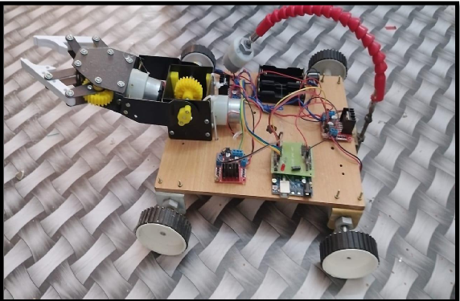
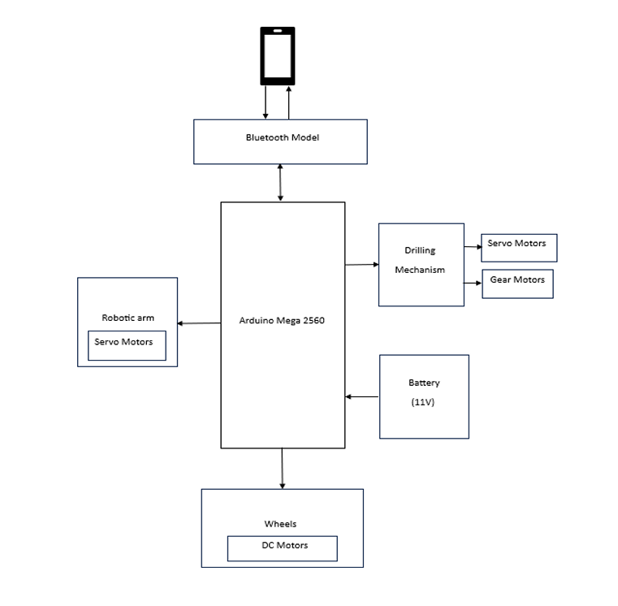

# 🌱 AGRIBOT – Smart Seed Planting Agricultural Robot

AGRIBOT is an intelligent agricultural robot designed to automate the seed planting process using robotics and embedded systems. The robot integrates a robotic arm, drilling mechanism, and Bluetooth-based control system to improve planting efficiency, accuracy, and productivity in farming.

The system is powered by the Arduino Mega 2560 microcontroller and controlled wirelessly via a mobile application using the HC-05 Bluetooth module. AGRIBOT demonstrates how modern technology can simplify traditional farming practices and contribute to the development of smart agriculture.

---

## 📌 Project Overview

Agriculture plays a vital role in sustaining human life, and with the advancement of technology, farming practices are becoming smarter and more efficient. AGRIBOT is designed to assist farmers by automating the seed planting process using a robotic platform.

The robot is capable of:
- Moving across the field
- Drilling holes in soil
- Placing seeds accurately using robotic arm
- Being controlled wirelessly via mobile phone

By reducing manual labor and improving precision, AGRIBOT helps farmers save time, reduce effort, and improve crop productivity.

---

## ✨ Key Features

- Automated seed planting system
- Bluetooth controlled robotic vehicle
- Robotic arm for precise seed placement
- Soil drilling mechanism for accurate depth
- Arduino Mega based control system
- Wireless control using mobile application
- Modular design for future improvements
- Efficient and cost-effective agricultural solution

---

## 🧰 Components Used

| Component | Description |
|----------|-------------|
| Arduino Mega 2560 | Main microcontroller |
| HC-05 Bluetooth Module | Wireless communication |
| DC Motors | Robot movement |
| Servo Motors | Robotic arm movement |
| Robotic Arm | Seed placement mechanism |
| Driller | Creates holes in soil |
| LiPo Battery | Power supply |
| Wheels | Movement of robot |
| Camera | Obstacle detection |
| PCB | Circuit connections |
| Connecting Wires | Electrical connections |

---

## 🏗️ System Architecture

The AGRIBOT system integrates mechanical, electronic, and software components to automate agricultural tasks.

The Arduino Mega 2560 acts as the central controller, receiving commands from a mobile device via Bluetooth. Based on user input, the robot moves across the field using DC motors.

The drilling mechanism creates holes in the soil, and the robotic arm places seeds into the holes with precision. The camera assists in identifying obstacles and ensures safe movement.

This combination of robotics and automation improves planting consistency and reduces manual effort.

---

## ⚙️ Working Principle

1. The robot is powered using LiPo battery supply.
2. The HC-05 Bluetooth module connects the robot to a mobile phone.
3. User sends control commands via mobile application.
4. DC motors move the robot forward or backward.
5. The drilling mechanism creates holes in the soil.
6. The robotic arm places seeds accurately into the holes.
7. The robot repeats the process for continuous planting.
8. Camera helps detect obstacles for safe navigation.

---

---

## 💻 Software Requirements

- Arduino IDE
- Serial Bluetooth Terminal Mobile App
- Required Arduino Libraries

---

## 📸 Project Demonstration

### Robot Hardware

### System Block Diagram

---

## 📊 Results

- Robot successfully performs automated seed planting
- Accurate drilling depth achieved
- Robotic arm places seeds precisely
- Smooth Bluetooth communication
- Reduced manual effort
- Consistent planting performance

The system demonstrated reliable performance during testing and showed potential for practical agricultural applications.

---

## 🚀 Applications

- Smart agriculture
- Precision farming
- Automated seed planting
- Agricultural robotics research
- IoT based farming solutions
- Educational robotics projects

---

## 🔮 Future Improvements

- Automatic irrigation system integration
- Solar powered energy system
- AI based obstacle detection
- Soil moisture sensing
- GPS based navigation
- Mobile app interface improvements
- Autonomous path planning
- Real-time data monitoring

---

## 👨‍💻 Author

**K Prasanth**  
Electronics Engineer  
Interested in Robotics, Automation and Embedded Systems

---

## 📜 License

This project is open-source and available under the MIT License.

---

## ⭐ Support

If you found this project helpful, consider giving it a star ⭐ to support the work.
